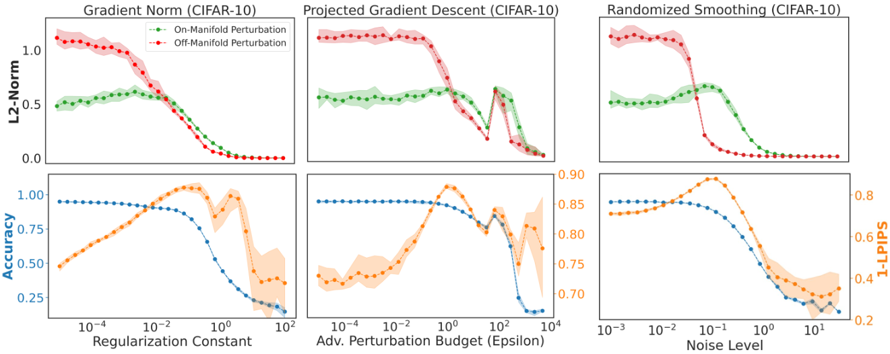

# Which Models have Perceptually-Aligned Gradients? An Explanation via Off-Manifold Robustness (Neurips 2023)

<p align="center">
  
</p>

This is the code repository for the NeurIPS'23 paper "Which Models have Perceptually-Aligned Gradients? An Explanation via Off-Manifold Robustness" by Suraj Srinivas, Sebastian Bordt and Himabindu Lakkaraju.

The repository contains the code to train regularized models on the different dataset, estimate on- and off-manifold robustness, and produce the various figures in the paper. 

## Overview

Here we briefly describe the structure of the code.

```run_experiments.py```: Entry point for the different experiments.

```experiments/measure_manifold_robustness.py```: Script to measure the on- and off-manifold robustness of models on CIFAR-10.

```experiments/measure_score_alignment.py```: Script to measure the alignment of models on CIFAR-10 with the score.

```notebooks/*```: Jupyter notebooks to perform analysis and generate the figures in the paper.

```train_models.py```: Train robust models on CIFAR-10. 

```train_robust_imagenet.py```: Train robust models with projected gradient descent on ImageNet64x64.

```utils/regularized_loss.py```: Defines the different regularized losses for training robust models.

```utils/edm_score.py```: Wrapping the [diffusion models](https://github.com/NVlabs/edm/) from Karas et al. (2022) to estimate the score.

## Citation

If you find this code useful in your research, pleas consider to cite our paper.

```
@inproceedings{srinivas2023pags,
  author    = {Suraj Srinivas and Sebastian Bordt and Himabindu Lakkaraju},
  title     = {Which Models have Perceptually-Aligned Gradients? An Explanation via Off-Manifold Robustness},
  booktitle = {NeurIPS},
  year      = {2023}
}
```

## Acknowledgements

- We use the [diffusion models](https://github.com/NVlabs/edm/) from Karas et al. "Elucidating the Design Space of Diffusion-Based Generative Models (EDM)", NeurIPS'22.

- We use the [robustness library](https://github.com/MadryLab/robustness) and pre-trained models from [repo]([https://github.com/microsoft/robust-models-transfer](https://www.microsoft.com/en-us/research/publication/do-adversarially-robust-imagenet-models-transfer-better/))

- We use the [LPIPS](https://github.com/richzhang/PerceptualSimilarity) metric from Zhang et al. "The Unreasonable Effectiveness of Deep Features as a Perceptual Metric", CVPR'18.
  
- We train an autoencoder on CIFAR-10 using [pythae](https://github.com/clementchadebec/benchmark_VAE/) from Chadebec et al. "Pythae: Unifying Generative Autoencoders in Python - A Benchmarking Use Case", NeurIPS'22.

- We use code from SURAJ PREVIOUS PAPERS, and [code](https://github.com/tml-tuebingen/explanations-manifold) from Bordt et al. "The Manifold Hypothesis for Gradient-Based Explanations" (2023).
